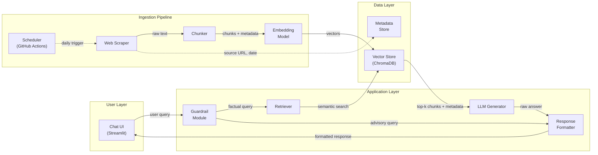
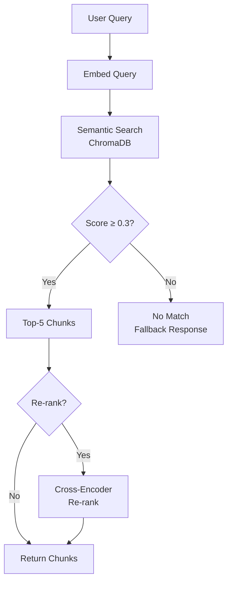
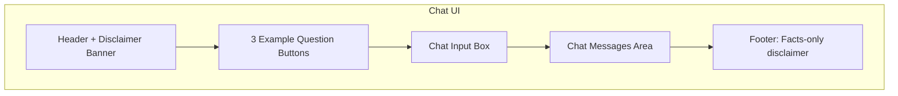
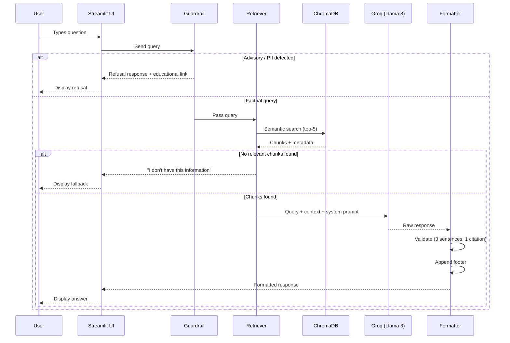

# Architecture: Mutual Fund FAQ Assistant

## 1. High-Level Overview

The Mutual Fund FAQ Assistant is a **Retrieval-Augmented Generation (RAG)** system that answers factual queries about HDFC Mutual Fund schemes using a curated corpus of 20 official public URLs. The architecture follows a classic **Ingest → Index → Retrieve → Generate** pipeline with an added **Guardrail** layer to enforce facts-only responses.



---

## 2. System Components

### 2.1 Ingestion Pipeline

The ingestion pipeline can be run **manually** or triggered **daily** via a GitHub Actions workflow (`daily_ingestion.yml`) to keep the corpus up-to-date. The GitHub Action automatically runs the scraper, regenerates the vector database in `data/chroma_db`, and commits the changes back to the repository.

#### 2.1.1 Web Scraper

| Aspect | Detail |
|--------|--------|
| **Purpose** | Fetch and extract text content from the 20 corpus URLs |
| **Tools** | `requests` + `BeautifulSoup4` for static HTML; `Selenium` or `Playwright` for JS-rendered pages (Groww) |
| **Output** | Raw text + metadata (`source_url`, `scheme_name`, `document_type`, `scrape_date`) |

**Source categories handled:**

| Category | # URLs | Scraping Strategy |
|----------|--------|-------------------|
| Groww Scheme Pages | 5 | Headless browser (JS-rendered) |
| HDFC AMC Factsheets | 5 | HTTP + HTML parser |
| SID / KIM / SAI | 3 | HTTP + HTML parser |
| AMC FAQ / Help | 3 | HTTP + HTML parser |
| AMFI / SEBI | 4 | HTTP + HTML parser |

#### 2.1.2 Text Chunker

| Aspect | Detail |
|--------|--------|
| **Strategy** | Recursive character splitting with overlap |
| **Chunk size** | 500 tokens (target) |
| **Overlap** | 50 tokens |
| **Library** | `langchain.text_splitter.RecursiveCharacterTextSplitter` |
| **Metadata preserved** | `source_url`, `scheme_name`, `document_type`, `chunk_index`, `scrape_date` |

**Why 500 tokens?** Small enough for precise retrieval, large enough to retain context for factual statements like expense ratios and exit loads.

#### 2.1.3 Embedding Model

| Aspect | Detail |
|--------|--------|
| **Model** | `BAAI/bge-small-en-v1.5` (384 dimensions) |
| **Alternative** | `BAAI/bge-base-en-v1.5` (768 dimensions, higher accuracy, larger) |
| **Hosting** | Local (CPU-friendly, ~130MB) |
| **Batch size** | 64 |

---

### 2.2 Vector Store

| Aspect | Detail |
|--------|--------|
| **Database** | ChromaDB (persistent local storage) |
| **Collection** | `hdfc_mutual_fund_corpus` |
| **Distance metric** | Cosine similarity |
| **Stored per record** | Embedding vector, chunk text, metadata dict |
| **Expected records** | ~800–1,200 chunks (20 documents × 40–60 chunks avg) |

**Why ChromaDB?** Lightweight, zero-infrastructure, Python-native, supports metadata filtering — ideal for a single-AMC corpus of this size.

#### Directory Structure

```
data/
├── raw/                    # Scraped raw HTML/text
│   ├── groww/
│   ├── hdfc_amc/
│   ├── sid_kim_sai/
│   └── amfi_sebi/
├── processed/              # Cleaned text files
├── chroma_db/              # ChromaDB persistent storage
└── metadata.json           # Source URL → scrape date mapping
```

---

### 2.3 Retriever

| Aspect | Detail |
|--------|--------|
| **Type** | Semantic search (dense retrieval) |
| **Top-k** | 5 chunks |
| **Re-ranking** | Optional — cross-encoder re-ranking with `cross-encoder/ms-marco-MiniLM-L-6-v2` |
| **Metadata filter** | Filter by `scheme_name` when the query mentions a specific fund |
| **Fallback** | If similarity score < 0.3 threshold, return "I don't have information on this" |

**Retrieval flow:**



---

### 2.4 Guardrail Module

The guardrail sits **before** retrieval and **after** generation to enforce compliance.

#### Pre-Retrieval Guard (Intent Classifier)

| Check | Method | Action |
|-------|--------|--------|
| **Advisory detection** | Keyword + LLM classification | Refuse with polite message + AMFI/SEBI link |
| **PII detection** | Regex patterns for PAN, Aadhaar, phone, email, OTP | Refuse with privacy notice |
| **Off-topic detection** | LLM classification (not about mutual funds) | Refuse with scope message |

**Advisory keyword patterns:**

```python
ADVISORY_PATTERNS = [
    r"\bshould\s+i\s+(invest|buy|sell|redeem)\b",
    r"\bwhich\s+(fund|scheme)\s+is\s+better\b",
    r"\brecommend\b",
    r"\badvice\b",
    r"\bgood\s+fund\b",
    r"\bbest\s+fund\b",
    r"\bcompare\s+(returns|performance)\b",
]
```

**PII regex patterns:**

```python
PII_PATTERNS = {
    "PAN":    r"[A-Z]{5}[0-9]{4}[A-Z]",
    "Aadhaar": r"\b\d{4}\s?\d{4}\s?\d{4}\b",
    "Phone":  r"\b[6-9]\d{9}\b",
    "Email":  r"[a-zA-Z0-9._%+-]+@[a-zA-Z0-9.-]+\.[a-zA-Z]{2,}",
    "OTP":    r"\b\d{4,6}\b",  # contextual check required
}
```

#### Post-Generation Guard

| Check | Method | Action |
|-------|--------|--------|
| **Response contains advice** | LLM self-check | Strip and regenerate |
| **Missing citation** | Regex for URL presence | Inject source URL from metadata |
| **Response too long** | Sentence count > 3 | Truncate to 3 sentences |

---

### 2.5 LLM Generator

| Aspect | Detail |
|--------|--------|
| **Primary Model** | Llama 3 70B (via Groq API) |
| **Alternative** | Llama 3 8B or Mixtral 8x7B (also on Groq) |
| **Temperature** | 0.1 (low creativity — facts only) |
| **Max output tokens** | 200 |
| **SDK** | `groq` Python SDK |
| **API Key** | Stored in `.env` file, loaded via `python-dotenv` |

#### System Prompt

```text
You are a facts-only mutual fund assistant for HDFC Mutual Fund schemes.

RULES:
1. Answer ONLY using the provided context chunks. Never use your own knowledge.
2. Keep responses to a MAXIMUM of 3 sentences.
3. Include EXACTLY ONE source citation URL from the context metadata.
4. End every response with: "Last updated from sources: <date>"
5. NEVER provide investment advice, opinions, or recommendations.
6. NEVER compare fund performance or calculate returns.
7. If the context does not contain the answer, say:
   "I don't have this information in my sources. Please check the official HDFC AMC website: https://www.hdfcfund.com"
8. For performance-related queries, respond with:
   "For performance data, please refer to the official factsheet: <factsheet_url>"
```

#### Prompt Template

```text
Context:
{retrieved_chunks}

Source URLs:
{source_urls}

Last scraped: {scrape_date}

User Question: {user_query}

Answer (max 3 sentences, 1 citation, facts only):
```

---

### 2.6 Response Formatter

| Step | Action |
|------|--------|
| 1 | Validate sentence count (≤ 3) |
| 2 | Validate exactly 1 citation link is present |
| 3 | Append footer: `Last updated from sources: <date>` |
| 4 | Format as markdown for the chat UI |

**Example formatted response:**

```
The expense ratio of HDFC Large Cap Fund – Direct Plan is 1.04%.
Source: https://groww.in/mutual-funds/hdfc-large-cap-fund-direct-growth

Last updated from sources: 2026-07-10
```

---

### 2.7 User Interface (Streamlit)

| Aspect | Detail |
|--------|--------|
| **Framework** | Streamlit |
| **Layout** | Single-page chat interface |
| **State management** | `st.session_state` for conversation history |

#### UI Components



**Welcome message:**
> 👋 Welcome! I'm your HDFC Mutual Fund FAQ Assistant. I can answer factual questions about HDFC Large Cap, Mid Cap, Small Cap, Gold ETF FoF, and Silver ETF FoF schemes.

**Example questions (clickable):**
1. "What is the expense ratio of HDFC Mid Cap Fund?"
2. "What is the minimum SIP amount for HDFC Small Cap Fund?"
3. "How do I download my capital gains statement?"

**Disclaimer (always visible):**
> ⚠️ Facts-only. No investment advice.

---

## 3. Data Flow — End-to-End



---

## 4. Tech Stack

| Layer | Technology | Version |
|-------|-----------|---------|
| **Language** | Python | 3.10+ |
| **Web Framework** | Streamlit | 1.35+ |
| **LLM SDK** | `groq` | Latest |
| **Embeddings** | `sentence-transformers` (BGE) | 3.0+ |
| **Vector Store** | ChromaDB | 0.5+ |
| **Text Splitting** | LangChain | 0.2+ |
| **Web Scraping** | `requests`, `BeautifulSoup4`, `Playwright` | Latest |
| **Environment** | `python-dotenv` | Latest |
| **Containerisation** | Docker (optional) | Latest |

---

## 5. Project Structure

```
Mutual Fund FAQ Assistant/
├── docs/
│   ├── problemStatement.txt
│   ├── problemStatement.md
│   └── architecture.md              ← This file
├── src/
│   ├── ingestion/
│   │   ├── __init__.py
│   │   ├── scraper.py               # Web scraping logic
│   │   ├── chunker.py               # Text splitting
│   │   └── embedder.py              # Embedding generation
│   ├── retrieval/
│   │   ├── __init__.py
│   │   ├── vector_store.py          # ChromaDB operations
│   │   └── retriever.py             # Semantic search + re-ranking
│   ├── generation/
│   │   ├── __init__.py
│   │   ├── llm_client.py            # LLM API wrapper
│   │   ├── prompt_templates.py      # System + user prompts
│   │   └── formatter.py             # Response validation + formatting
│   ├── guardrails/
│   │   ├── __init__.py
│   │   ├── intent_classifier.py     # Advisory / PII / off-topic detection
│   │   └── post_generation.py       # Output validation
│   └── app.py                       # Streamlit entry point
├── data/
│   ├── raw/
│   ├── processed/
│   ├── chroma_db/
│   └── metadata.json
├── tests/
│   ├── test_guardrails.py
│   ├── test_retriever.py
│   └── test_formatter.py
├── scripts/
│   └── ingest.py                    # CLI script to run ingestion pipeline
├── .env.example
├── requirements.txt
├── Dockerfile
└── README.md
```

---

## 6. Configuration

All configuration is centralised in environment variables and a config object:

```python
# .env.example
GROQ_API_KEY=your_groq_api_key_here
CHROMA_DB_PATH=./data/chroma_db
EMBEDDING_MODEL=BAAI/bge-small-en-v1.5
LLM_MODEL=llama3-70b-8192
LLM_TEMPERATURE=0.1
LLM_MAX_TOKENS=200
RETRIEVER_TOP_K=5
SIMILARITY_THRESHOLD=0.3
CHUNK_SIZE=500
CHUNK_OVERLAP=50
```

---

## 7. Refusal Response Templates

### Advisory Query Refusal

```
I'm a facts-only assistant and cannot provide investment advice or recommendations.
For guidance on investing, visit AMFI's investor education page:
https://www.amfiindia.com/investor-corner/knowledge-center/what-are-mutual-funds.html

⚠️ Facts-only. No investment advice.
```

### PII Detected Refusal

```
For your security, I cannot process personal information like PAN, Aadhaar,
phone numbers, or email addresses. Please never share sensitive data in this chat.
```

### Off-Topic Refusal

```
I can only answer factual questions about HDFC Mutual Fund schemes
(Large Cap, Mid Cap, Small Cap, Gold ETF FoF, Silver ETF FoF).
Please ask a question about one of these schemes.
```

---

## 8. Performance & Scalability

| Metric | Target |
|--------|--------|
| **Query latency** | < 3 seconds (end-to-end) |
| **Embedding time** | < 0.5s per query |
| **Retrieval time** | < 0.2s (ChromaDB local) |
| **LLM generation** | < 1s (Groq API — hardware-accelerated inference) |
| **Corpus size** | ~800–1,200 chunks |
| **Concurrent users** | 1–5 (Streamlit single-process) |

---

## 9. Security Considerations

| Concern | Mitigation |
|---------|------------|
| **API key exposure** | `.env` file, never committed to Git |
| **PII leakage** | Pre-retrieval PII regex guard, no data logging |
| **Prompt injection** | System prompt hardened, user input sanitised |
| **Data integrity** | Corpus sourced only from official URLs |
| **No user data storage** | No database, no cookies, no session persistence beyond runtime |

---

## 10. Known Limitations

1. **Static corpus** — Data is scraped at ingestion time; NAV, AUM, and expense ratios may become stale. Requires periodic re-ingestion.
2. **JS-rendered pages** — Groww pages require a headless browser, adding complexity and scrape time.
3. **Single AMC scope** — Only covers HDFC Mutual Fund; extending to other AMCs requires additional corpus curation.
4. **No conversation memory** — Each query is independent; the assistant does not support multi-turn follow-ups referencing prior answers.
5. **LLM hallucination risk** — Mitigated by low temperature and strict context-only prompting, but not fully eliminated.

---

## 11. Future Enhancements

| Enhancement | Description |
|-------------|-------------|
| **Multi-AMC support** | Extend corpus to cover additional AMCs and schemes |
| **Hybrid retrieval** | Combine dense (semantic) + sparse (BM25) retrieval for better recall |
| **Conversational memory** | Add session-based context window for follow-up questions |
| **Admin dashboard** | UI to monitor query logs, retrieval quality, and refusal rates |
| **Evaluation framework** | Automated RAG evaluation using RAGAS (faithfulness, relevance, context recall) |
