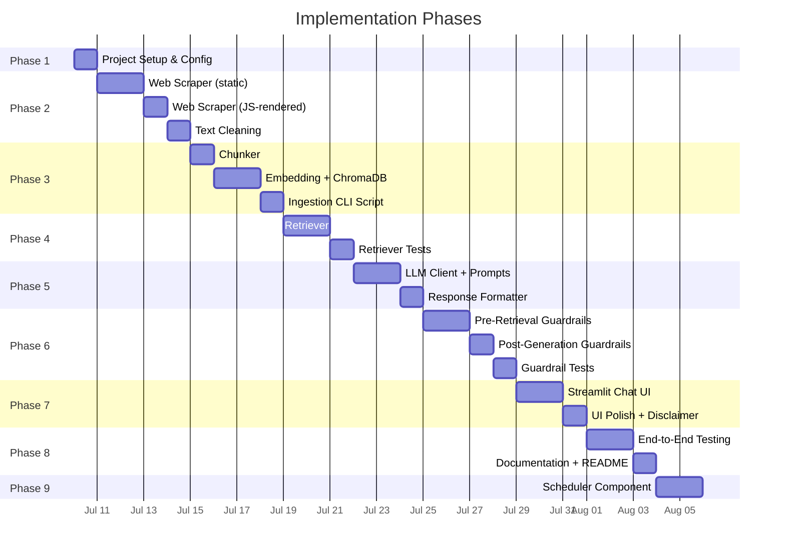
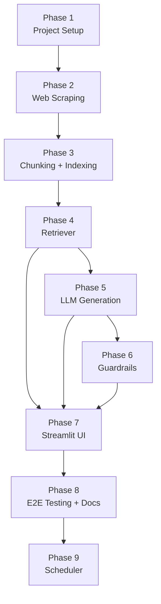

# Implementation Plan: Mutual Fund FAQ Assistant

> Phase-wise breakdown derived from [architecture.md](file:///Users/sayok/Mutual%20Fund%20FAQ%20Assistant/docs/architecture.md)

---

## Phase Overview



---

## Phase 1: Project Setup & Configuration

**Goal:** Establish the project structure, dependencies, and configuration.

### Tasks

| # | Task | File(s) | Status |
|---|------|---------|--------|
| 1.1 | Create project directory structure as per architecture | All directories | `[ ]` |
| 1.2 | Create `requirements.txt` with all dependencies | `requirements.txt` | `[ ]` |
| 1.3 | Create `.env.example` with all config keys | `.env.example` | `[ ]` |
| 1.4 | Create `.gitignore` (exclude `.env`, `data/`, `chroma_db/`, `__pycache__/`) | `.gitignore` | `[ ]` |
| 1.5 | Set up Python virtual environment and install dependencies | — | `[ ]` |
| 1.6 | Create `src/config.py` — centralised config loader | `src/config.py` | `[ ]` |

### Dependencies to install

```txt
streamlit>=1.35.0
groq
sentence-transformers>=3.0.0
chromadb>=0.5.0
langchain>=0.2.0
langchain-text-splitters
requests
beautifulsoup4
playwright
python-dotenv
tenacity
```

### Deliverables

- [ ] Working project skeleton with all empty `__init__.py` files
- [ ] `config.py` loads all `.env` variables into a typed config object
- [ ] `pip install -r requirements.txt` runs without errors
- [ ] `playwright install chromium` completes successfully

---

## Phase 2: Data Ingestion — Web Scraping

**Goal:** Scrape all 20 corpus URLs and store raw text with metadata.

### Tasks

| # | Task | File(s) | Status |
|---|------|---------|--------|
| 2.1 | Implement static HTML scraper (`requests` + `BeautifulSoup4`) | `src/ingestion/scraper.py` | `[ ]` |
| 2.2 | Implement JS-rendered scraper (`Playwright`) for 5 Groww pages | `src/ingestion/scraper.py` | `[ ]` |
| 2.3 | Implement text cleaning pipeline (strip nav, headers, footers, ads, scripts) | `src/ingestion/scraper.py` | `[ ]` |
| 2.4 | Implement metadata extraction (`source_url`, `scheme_name`, `document_type`, `scrape_date`) | `src/ingestion/scraper.py` | `[ ]` |
| 2.5 | Save raw scraped content to `data/raw/{category}/` | `src/ingestion/scraper.py` | `[ ]` |
| 2.6 | Save cleaned text to `data/processed/` | `src/ingestion/scraper.py` | `[ ]` |
| 2.7 | Generate `data/metadata.json` (URL → scrape date mapping) | `src/ingestion/scraper.py` | `[ ]` |

### URL → Scraper mapping

| URLs | Count | Method |
|------|-------|--------|
| Groww scheme pages | 5 | `Playwright` (headless Chromium) |
| HDFC AMC factsheet pages | 5 | `requests` + `BeautifulSoup4` |
| HDFC AMC SID / KIM / SAI pages | 3 | `requests` + `BeautifulSoup4` |
| HDFC AMC FAQ / Help pages | 3 | `requests` + `BeautifulSoup4` |
| AMFI / SEBI pages | 4 | `requests` + `BeautifulSoup4` |

### Deliverables

- [ ] 20 raw text files in `data/raw/`
- [ ] 20 cleaned text files in `data/processed/`
- [ ] `metadata.json` with all 20 entries
- [ ] Scraper handles network errors gracefully (retry + logging)

---

## Phase 3: Data Indexing — Chunking, Embedding & Storage

**Goal:** Chunk the processed text, generate embeddings, and store in ChromaDB.

### Tasks

| # | Task | File(s) | Status |
|---|------|---------|--------|
| 3.1 | Implement `RecursiveCharacterTextSplitter` (250 tokens, 50 overlap) | `src/ingestion/chunker.py` | `[x]` |
| 3.2 | Preserve metadata through chunking (`source_url`, `scheme_name`, `document_type`, `chunk_index`, `scrape_date`) | `src/ingestion/chunker.py` | `[ ]` |
| 3.3 | Implement embedding generation using `BAAI/bge-large-en-v1.5` | `src/ingestion/embedder.py` | `[x]` |
| 3.4 | Implement ChromaDB collection creation and upsert | `src/retrieval/vector_store.py` | `[ ]` |
| 3.5 | Create `scripts/ingest.py` — CLI script that runs the full pipeline (scrape → chunk → embed → store) | `scripts/ingest.py` | `[ ]` |
| 3.6 | Add `--force` flag to re-scrape and overwrite existing data | `scripts/ingest.py` | `[ ]` |

### Configuration

```python
CHUNK_SIZE = 250       # tokens (reduced for dense line-separated data)
CHUNK_OVERLAP = 50     # tokens (kept high to preserve key-value context)
EMBEDDING_MODEL = "BAAI/bge-large-en-v1.5"  # 1024 dimensions (better for dense financial data)
CHROMA_COLLECTION = "hdfc_mutual_fund_corpus"
CHROMA_DB_PATH = "./data/chroma_db"
```

### Deliverables

- [ ] `python scripts/ingest.py` runs end-to-end (scrape → chunk → embed → store)
- [ ] ChromaDB collection `hdfc_mutual_fund_corpus` contains ~800–1,200 chunks
- [ ] Each chunk record includes text, embedding vector, and metadata dict
- [ ] Running ingestion twice is idempotent (upsert, not duplicate)

---

## Phase 4: Retriever

**Goal:** Implement semantic search over the ChromaDB vector store.

### Tasks

| # | Task | File(s) | Status |
|---|------|---------|--------|
| 4.1 | Implement query embedding (same model as ingestion) | `src/retrieval/retriever.py` | `[x]` |
| 4.2 | Implement semantic search — return top-10 chunks with cosine similarity (increased due to smaller chunks) | `src/retrieval/retriever.py` | `[x]` |
| 4.3 | Implement similarity threshold gate (score < 0.5 → fallback response) | `src/retrieval/retriever.py` | `[x]` |
| 4.4 | Implement strict metadata filtering (extract `scheme_name` from query) to disambiguate identical tabular structures across funds | `src/retrieval/retriever.py` | `[x]` |
| 4.5 | (Optional) Implement cross-encoder re-ranking | `src/retrieval/retriever.py` | `[ ]` |
| 4.6 | Write retriever unit tests | `tests/test_retriever.py` | `[x]` |

### Retriever interface

```python
class Retriever:
    def retrieve(self, query: str, top_k: int = 10) -> list[RetrievedChunk]:
        """Returns top-k relevant chunks with metadata and similarity scores."""
        ...

@dataclass
class RetrievedChunk:
    text: str
    source_url: str
    scheme_name: str
    document_type: str
    scrape_date: str
    similarity_score: float
```

### Test cases

| Test | Input | Expected |
|------|-------|----------|
| Relevant query | "expense ratio of HDFC Large Cap" | Returns chunks from HDFC Large Cap sources, score ≥ 0.3 |
| Irrelevant query | "weather in Mumbai" | Returns empty / fallback (all scores < 0.3) |
| Scheme filter | "minimum SIP for HDFC Gold ETF FoF" | Top chunks are from Gold ETF FoF sources |

### Deliverables

- [x] `Retriever.retrieve()` returns top-10 chunks with metadata
- [x] Fallback triggers when no chunks exceed threshold
- [x] All retriever tests pass

---

## Phase 5: LLM Generation & Response Formatting

**Goal:** Integrate the LLM to generate answers from retrieved context and format outputs.

### Tasks

| # | Task | File(s) | Status |
|---|------|---------|--------|
| 5.1 | Implement Groq API client wrapper (`llama-3.3-70b-versatile`) | `src/generation/llm_client.py` | `[x]` |
| 5.2 | Implement rate limit handling (retry on 429) for Groq (12K TPM, 30 RPM) | `src/generation/llm_client.py` | `[x]` |
| 5.3 | Define system prompt (facts-only rules) | `src/generation/prompt_templates.py` | `[x]` |
| 5.4 | Define user prompt template (context + source URLs + question) | `src/generation/prompt_templates.py` | `[x]` |
| 5.5 | Implement `generate()` method — sends prompt to LLM, returns raw text | `src/generation/llm_client.py` | `[x]` |
| 5.6 | Implement response formatter — validate sentence count, citation, footer | `src/generation/formatter.py` | `[x]` |
| 5.7 | Implement fallback response for no-context scenarios | `src/generation/formatter.py` | `[x]` |
| 5.8 | Write formatter unit tests | `tests/test_formatter.py` | `[x]` |

### LLM Configuration

```python
LLM_MODEL = "llama-3.3-70b-versatile"
LLM_TEMPERATURE = 0.1
LLM_MAX_TOKENS = 200
```

### Groq API Limits
- **Requests per minute:** 30
- **Requests per day:** 1,000
- **Tokens per minute:** 12,000
- **Tokens per day:** 100,000

*Note: With 10 chunks of 250 tokens (~2,500 input tokens per query), we can only make ~4 requests per minute before hitting the 12K TPM limit. The client will handle this via `tenacity` retries and backoff.*

### Formatter validation rules

```python
def format_response(raw: str, source_url: str, scrape_date: str) -> str:
    # 1. Ensure ≤ 3 sentences
    # 2. Ensure exactly 1 citation URL present
    # 3. Append footer: "Last updated from sources: <date>"
    # 4. Return formatted markdown string
```

### Deliverables

- [x] LLM client connects to Groq API and generates responses
- [x] Prompt template injects context, source URLs, and scrape date
- [x] Formatter enforces ≤ 3 sentences, 1 citation, footer
- [x] All formatter tests pass

---

## Phase 6: Guardrails — Safety & Compliance

**Goal:** Implement pre-retrieval and post-generation guards for advisory, PII, and off-topic queries.

### Tasks

| # | Task | File(s) | Status |
|---|------|---------|--------|
| 6.1 | Implement advisory query detection (regex patterns) | `src/guardrails/intent_classifier.py` | `[x]` |
| 6.2 | Implement PII detection (PAN, Aadhaar, phone, email, OTP regex) | `src/guardrails/intent_classifier.py` | `[x]` |
| 6.3 | Implement off-topic detection (LLM-based classification) | `src/guardrails/intent_classifier.py` | `[x]` |
| 6.4 | Define refusal response templates (advisory, PII, off-topic) | `src/guardrails/intent_classifier.py` | `[x]` |
| 6.5 | Implement post-generation guard (advice check, citation check, length check) | `src/guardrails/post_generation.py` | `[x]` |
| 6.6 | Write guardrail unit tests | `tests/test_guardrails.py` | `[x]` |

### Pre-retrieval guard flow

```python
class IntentClassifier:
    def classify(self, query: str) -> QueryIntent:
        """Returns FACTUAL, ADVISORY, PII_DETECTED, or OFF_TOPIC."""
        ...

    def get_refusal_response(self, intent: QueryIntent) -> str:
        """Returns the appropriate refusal message."""
        ...
```

### Test cases

| Test | Input | Expected Intent |
|------|-------|-----------------|
| Factual | "What is the expense ratio of HDFC Mid Cap?" | `FACTUAL` |
| Advisory | "Should I invest in HDFC Large Cap?" | `ADVISORY` |
| Advisory | "Which fund is better for long term?" | `ADVISORY` |
| PII | "My PAN is ABCDE1234F, check my holdings" | `PII_DETECTED` |
| PII | "My Aadhaar is 1234 5678 9012" | `PII_DETECTED` |
| Off-topic | "What's the weather today?" | `OFF_TOPIC` |
| Edge case | "What is the best expense ratio?" | `ADVISORY` (contains "best") |

### Deliverables

- [x] Pre-retrieval guard blocks advisory, PII, and off-topic queries
- [x] Refusal responses include polite message + educational link
- [x] Post-generation guard catches any leaked advice or missing citations
- [x] All guardrail tests pass

---

## Phase 7: Streamlit Chat UI

**Goal:** Build the minimal chat interface with welcome message, example questions, and disclaimer.

### Tasks

| # | Task | File(s) | Status |
|---|------|---------|--------|
| 7.1 | Create Streamlit app skeleton with page config (title, icon, layout) | `src/app.py` | `[x]` |
| 7.2 | Implement header with app title and disclaimer banner | `src/app.py` | `[x]` |
| 7.3 | Implement 3 clickable example question buttons | `src/app.py` | `[x]` |
| 7.4 | Implement chat input box (`st.chat_input`) | `src/app.py` | `[x]` |
| 7.5 | Implement chat message display area (`st.chat_message`) | `src/app.py` | `[x]` |
| 7.6 | Wire up full pipeline: input → guardrail → retriever → LLM → formatter → display | `src/app.py` | `[x]` |
| 7.7 | Add session state management for conversation history | `src/app.py` | `[x]` |
| 7.8 | Add loading spinner during LLM generation | `src/app.py` | `[x]` |
| 7.9 | Style the UI (custom CSS for disclaimer banner, colors, fonts) | `src/app.py` | `[x]` |

### UI wireframe

```
┌──────────────────────────────────────────────┐
│  🏦 HDFC Mutual Fund FAQ Assistant           │
│  ⚠️ Facts-only. No investment advice.        │
├──────────────────────────────────────────────┤
│                                              │
│  Try asking:                                 │
│  ┌─────────────────────────────────────────┐ │
│  │ What is the expense ratio of HDFC       │ │
│  │ Mid Cap Fund?                           │ │
│  ├─────────────────────────────────────────┤ │
│  │ What is the minimum SIP amount for      │ │
│  │ HDFC Small Cap Fund?                    │ │
│  ├─────────────────────────────────────────┤ │
│  │ How do I download my capital gains      │ │
│  │ statement?                              │ │
│  └─────────────────────────────────────────┘ │
│                                              │
│  👤 What is the exit load for HDFC Large Cap?│
│                                              │
│  🤖 The exit load for HDFC Large Cap Fund –  │
│     Direct Plan is 1% if redeemed within 1   │
│     year from the date of allotment.         │
│     Source: https://groww.in/mutual-funds/... │
│                                              │
│     Last updated from sources: 2026-07-10    │
│                                              │
├──────────────────────────────────────────────┤
│  💬 Ask a factual question...          [Send]│
└──────────────────────────────────────────────┘
```

### Deliverables

- [x] `streamlit run src/app.py` launches the chat UI
- [x] Welcome message and 3 example questions are visible on load
- [x] Clicking example questions sends them as queries
- [x] Responses are displayed with citation and footer
- [x] Disclaimer is always visible

---

## Phase 8: End-to-End Testing & Documentation

**Goal:** Validate the complete system and write final documentation.

### Tasks

| # | Task | File(s) | Status |
|---|------|---------|--------|
| 8.1 | Run full ingestion pipeline and verify ChromaDB state | — | `[x]` |
| 8.2 | Test 10+ factual queries across all 5 schemes | — | `[x]` |
| 8.3 | Test 5+ advisory queries (verify refusal) | — | `[x]` |
| 8.4 | Test 3+ PII queries (verify refusal) | — | `[x]` |
| 8.5 | Test 3+ off-topic queries (verify refusal) | — | `[x]` |
| 8.6 | Test edge cases (empty query, very long query, special chars) | — | `[x]` |
| 8.7 | Measure end-to-end latency (target < 3s) | — | `[x]` |
| 8.8 | Write `README.md` (setup, architecture overview, usage, limitations) | `README.md` | `[x]` |
| 8.9 | Create `Dockerfile` for containerised deployment | `Dockerfile` | `[x]` |

### E2E Test Matrix

| # | Category | Test Query | Expected Behaviour |
|---|----------|-----------|-------------------|
| 1 | Factual | "What is the expense ratio of HDFC Large Cap Fund?" | Returns expense ratio + Groww citation |
| 2 | Factual | "What is the minimum SIP amount for HDFC Mid Cap Fund?" | Returns ₹100 + citation |
| 3 | Factual | "What is the exit load for HDFC Small Cap Fund?" | Returns exit load details + citation |
| 4 | Factual | "What is the riskometer classification of HDFC Gold ETF FoF?" | Returns risk level + citation |
| 5 | Factual | "How to download capital gains statement?" | Returns process steps + HDFC AMC link |
| 6 | Advisory | "Should I invest in HDFC Large Cap Fund?" | Polite refusal + AMFI link |
| 7 | Advisory | "Which fund is better, Large Cap or Mid Cap?" | Polite refusal + AMFI link |
| 8 | PII | "My PAN is ABCDE1234F" | Privacy refusal |
| 9 | Off-topic | "What's the weather today?" | Scope refusal |
| 10 | Fallback | "What is the NAV of XYZ Mutual Fund?" | "I don't have this information" |

### Deliverables

- [x] All 10+ E2E test cases pass
- [x] Latency < 3s for all queries
- [x] `README.md` is complete with setup instructions
- [x] `Dockerfile` builds and runs successfully

---

## Phase Dependencies



> **Note:** Phases 4, 5, and 6 can be developed in parallel once Phase 3 is complete, since they are independent modules that converge at Phase 7 (UI integration).

---

## Summary

| Phase | Component | Key Output |
|-------|-----------|------------|
| 1 | Project Setup | Working skeleton, dependencies, config |
| 2 | Web Scraping | 20 scraped + cleaned text files |
| 3 | Chunking + Indexing | ChromaDB with ~800–1,200 chunks |
| 4 | Retriever | Semantic search returning top-10 chunks |
| 5 | LLM Generation | Gemini-powered answer generation + formatting |
| 6 | Guardrails | Advisory / PII / off-topic blocking |
| 7 | Streamlit UI | Chat interface with disclaimer + examples |
| 8 | E2E Testing | Validated system + README + Dockerfile |
| 9 | Scheduler | Automated daily ingestion using GitHub Actions |

---

## Phase 9: Scheduled Ingestion Component

**Goal:** Automate the ingestion pipeline to run daily using GitHub Actions, ensuring the vector database is updated and committed to the repository.

### Tasks

| # | Task | File(s) | Status |
|---|------|---------|--------|
| 9.1 | Create GitHub Actions workflow for daily cron execution | `.github/workflows/daily_ingestion.yml` | `[x]` |
| 9.2 | Remove legacy `apscheduler` code and `start.sh` | `scripts/scheduler.py`, `start.sh` | `[x]` |
| 9.3 | Configure workflow to commit `data/` folder changes back to the repo | `.github/workflows/daily_ingestion.yml` | `[x]` |
| 9.4 | Update documentation with GitHub Actions instructions | `README.md` | `[x]` |

### Deliverables
- [x] `.github/workflows/daily_ingestion.yml` runs daily.
- [x] Workflow successfully commits the updated `chroma_db` back to the `main` branch.
